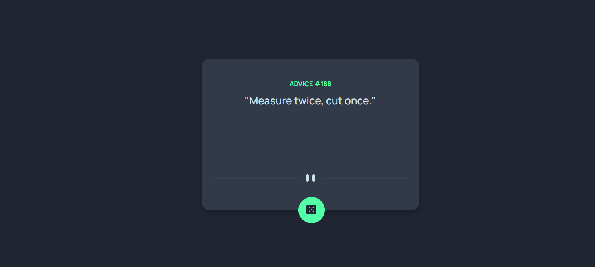

# Frontend Mentor - Advice generator app solution

This is a solution to the [Advice generator app challenge on Frontend Mentor](https://www.frontendmentor.io/challenges/advice-generator-app-QdUG-13db). Frontend Mentor challenges help you improve your coding skills by building realistic projects.

## Table of contents

- [Overview](#overview)
  - [The challenge](#the-challenge)
  - [Screenshot](#screenshot)
  - [Links](#links)
- [My process](#my-process)
  - [Built with](#built-with)
  - [What I learned](#what-i-learned)
  - [Continued development](#continued-development)
  - [Useful resources](#useful-resources)
- [Author](#author)
- [Acknowledgments](#acknowledgments)

**Note: Delete this note and update the table of contents based on what sections you keep.**

## Overview

### The challenge

Users should be able to:

- View the optimal layout for the app depending on their device's screen size
- See hover states for all interactive elements on the page
- Generate a new piece of advice by clicking the dice icon

### Screenshot




**Note: Delete this note and the paragraphs above when you add your screenshot. If you prefer not to add a screenshot, feel free to remove this entire section.**


## My process

### Built with

- Semantic HTML5 markup
- CSS custom properties
- Flexbox
- Vanilla Js

**Note: These are just examples. Delete this note and replace the list above with your own choices**

### What I learned

I learned how to use an API, Using promises(async await) and the fetch method, I also learned positioning in css.


```css
// I'm pround of this two, glowing button, YAH!!!!!
.btn{
    position: absolute;
    text-align: center;
    bottom: -8%;
    left: 44.5%;
    right: 0;
    height: 40px;
    width: 40px;
    border-radius: 50%;
    background:  hsl(150, 100%, 66%);
    border: none;
}

.btn:hover{
    color: rgba(255, 255, 255, 1);
    box-shadow: .1px 0px 10px 10px hsla(150, 100%, 66%, 0.205);
}
```
```js
'proud of this function'
 async function getAdvice(){
    const res = await fetch('#');
    data = await res.json()
    addAdvice(data.slip.advice)
    addAdviceId(data.slip.id)

    
    return data
}

```

If you want more help with writing markdown, we'd recommend checking out [The Markdown Guide](https://www.markdownguide.org/) to learn more.

**Note: Delete this note and the content within this section and replace with your own learnings.**

### Continued development

I need to keep on workingg on my JS and CSS skills, I won't give up and i will never!!!!

**Note: Delete this note and the content within this section and replace with your own plans for continued development.**

### Useful resources
w3Schools and stack Overflow!!!

**Note: Delete this note and replace the list above with resources that helped you during the challenge. These could come in handy for anyone viewing your solution or for yourself when you look back on this project in the future.**

## Author


**Note: Delete this note and add/remove/edit lines above based on what links you'd like to share.**

## Acknowledgments
I tried!
**Note: Delete this note and edit this section's content as necessary. If you completed this challenge by yourself, feel free to delete this section entirely.**
